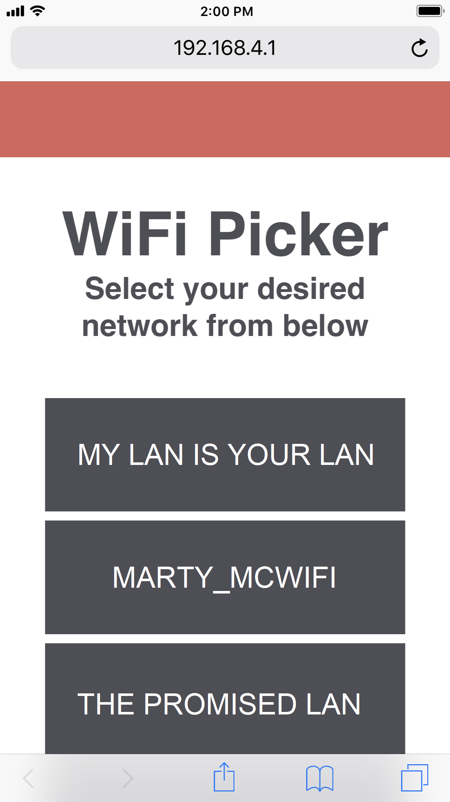
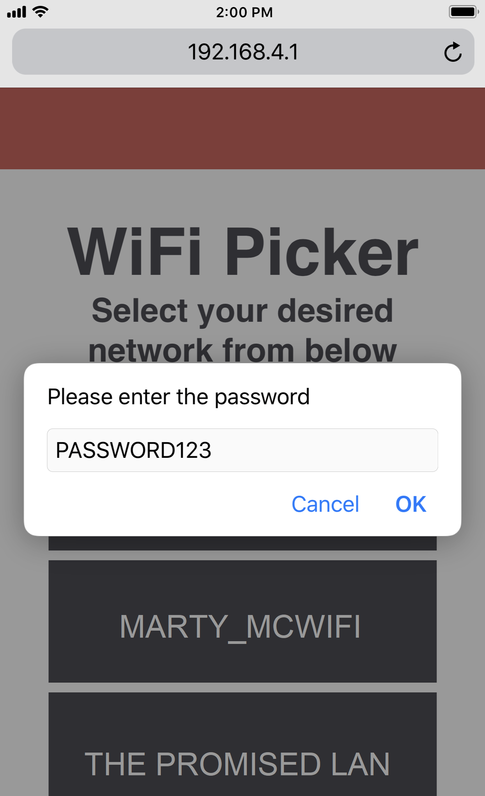

# wifiPicker
#### A WiFi provisioning library for the ESP32
wifiPicker is a library meant to make connecting an ESP32 easy. The library will first check if any known networks are around, if so, it will connect to that. If there is no known network, it will create one for you. Once connected, navigate to 192.168.4.1 to select a network from a list. Enter in the password and your ESP32 will connect to it. 

If you power off the ESP32, it will remember the credentials for the next time it comes on. In other words, you will only need to set up the network once.

## To Install:
Download the zip and extract all the contents into your libraries folder. Make sure that the following libraries are all added:

* arduinoWebSockets modified from [Links2004](https://github.com/Links2004)
* AsyncTCP from [me-no-dev](https://github.com/me-no-dev)
* Hash modified from [esp8266](https://github.com/esp8266)
* WebServer modified from [esp8266](https://github.com/esp8266)
* wifiPicker

## To Use:
Add the wifiPicker library to your project:

>~~~~
#include "wifiPicker.h"
~~~~

Add the following lines to the top of your code:
>~~~~
const char* AP_SSID = "ACCESS_POINT_SSID";
const char* AP_PW   = "ACCESS_POINT_PW";
~~~~

And then lastly, add this in your setup:
>~~~~
wifiPicker(AP_SSID,AP_PW);
~~~~

It is possible to change the syling by going into wifiPicker.h and modifying the content there.

## Password page
